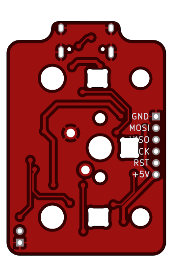

# ISOlation PCB

### Features

- Full key and stabilizer RGB
- Screw-in stabilizer support
- Powered by an Atmega328p
- Basic ESD and overvoltage protection
- Centered USB type-C port for a detachable cable
- Fully programmable using [QMK](https://qmk.fm) and [Vial](https://get.vial.today)

---

### Preview

